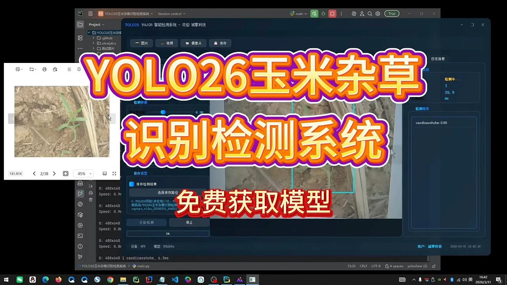
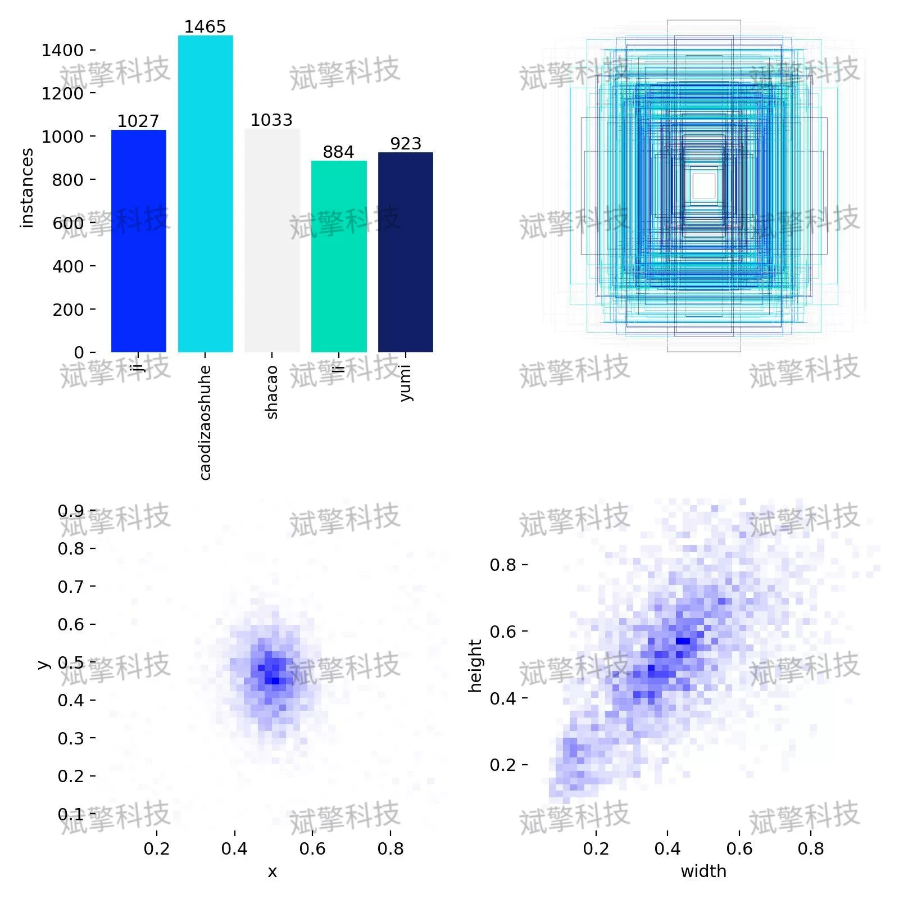
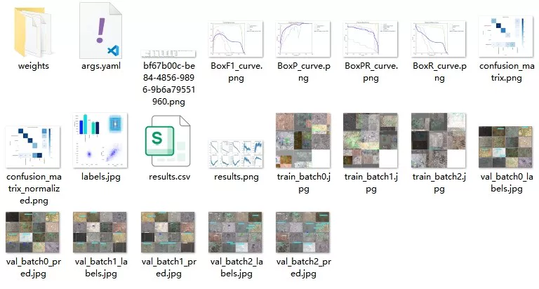
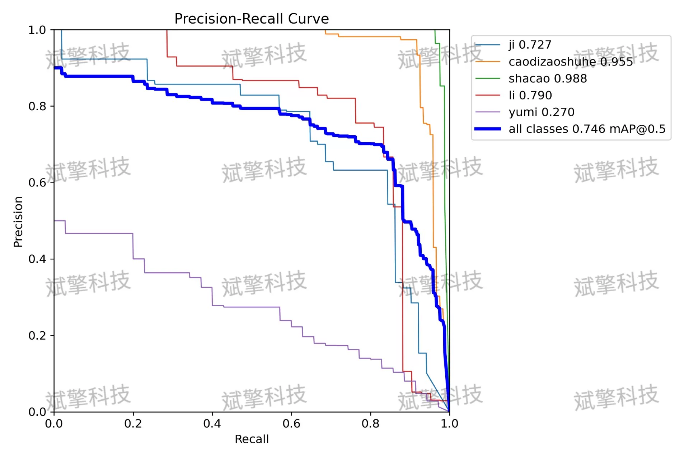
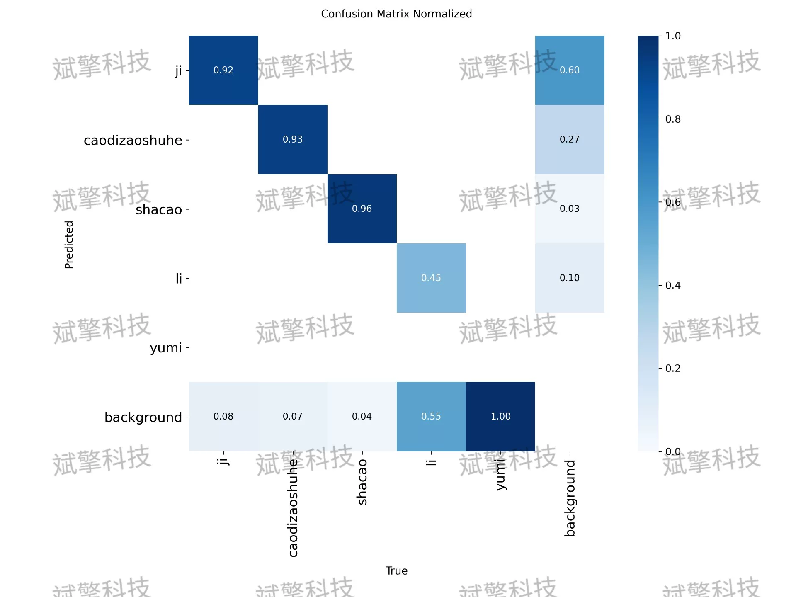
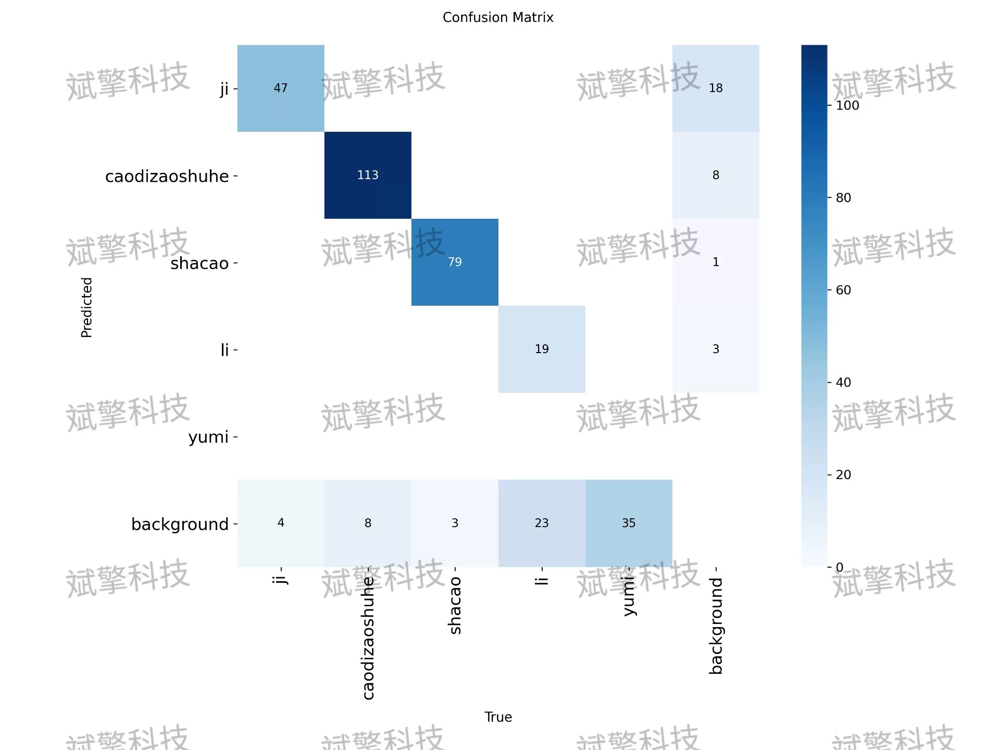
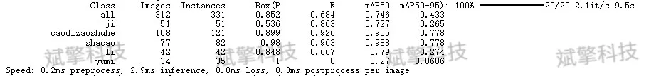
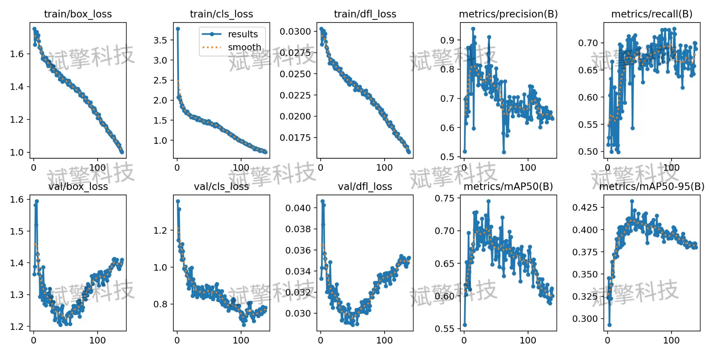
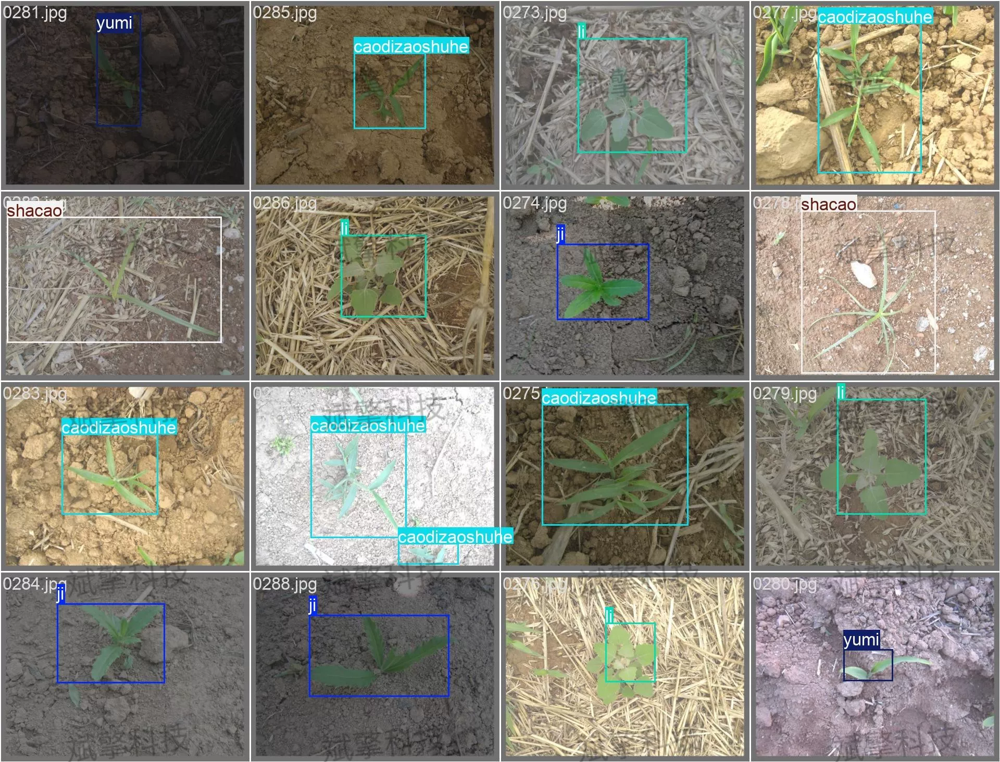

# YOLOv26 corn weed detection system | model + source code

## Body

YOLO26 Cornfield Weed Detection System | Model + Source Code: YOLO26 Real-World Practice: Corn and Weed Detection, Training with 5000 Images (Project Source Code + Dataset + Model Weights + UI Interface + Python + Deep Learning + Remote Deployment)

This study proposes and implements a cornfield weed intelligent recognition detection system based on the YOLO26 (You Only Look Once) architecture. It aims to solve the problem of low efficiency in weed and crop identification in traditional agriculture. The system is constructed for the corn planting environment, comprising a dataset containing 5 classes of targets, with 4971 training images and 312 validation images. The experimental results show that the model performs excellently in comprehensive metrics, achieving an overall mAP@0.5 of 0.746. Among them, the detection accuracy for the "weed" category is extremely high (mAP@0.5=0.988). This system provides a feasible technical solution for precision agriculture's automation in weeding and crop monitoring.

The dataset contains 5 detection categories as follows:
ji: Chicken (as field disturbance or specific monitoring target)
caodizaoshuhe: Grassland crops (may refer to specific companion crops or plants in specific growth states)
shacao: Weed (main detection target)
li: Li (refers to certain plants or mislabeled, need to be combined with actual scenarios)
yumi: Corn (core crop target)

To ensure the generalization ability of the model, the dataset is divided as follows:
Training set: 4971 images. Used for parameter learning and feature extraction of the model.
Validation set: 312 images.

Free reservation for remote installation. Unsuccessful full refund.
Purchase Enjoy the following resources (Baidu Drive auto unlock)
   - YOLO Detection Project Complete Source Code
   - YOLO format Dataset
   - Training code + UI interface code
   - Trained model + result images
   - Software install package
   - Add WeChat reservation for remote installation (Purchase will automatically display WeChat ID) - Unsuccessful full refund

⚙️ Core Function Modules
Detection Capability
    Image Detection: Upon upload, returns detection boxes + class information
    Video Detection: Supports video files, analyzes frames accurately
    Camera Real-Time Detection: Connects USB camera, realizes dynamic monitoring
Interaction and Control
    Target Filtering: Choose one or more categories for detection
    Parameter Real-Time Adjustment: Adjustable confidence threshold & IoU threshold, flexibly control accuracy
    Result Save: One-click save of image/video/camera detection results
System and Data
    User Login and Registration: Support password strength detection + Encrypted storage
    Log Recording: Auto record operation and error information (timestamped)

## Images

## Payment

Here is a pay link on Stripe ( https://buy.stripe.com/3cs8yP7sY87d0vu9AB ). Please contact me lonlonago@foxmail.com after funding $89, and I will send you a complete data files , thank you!

